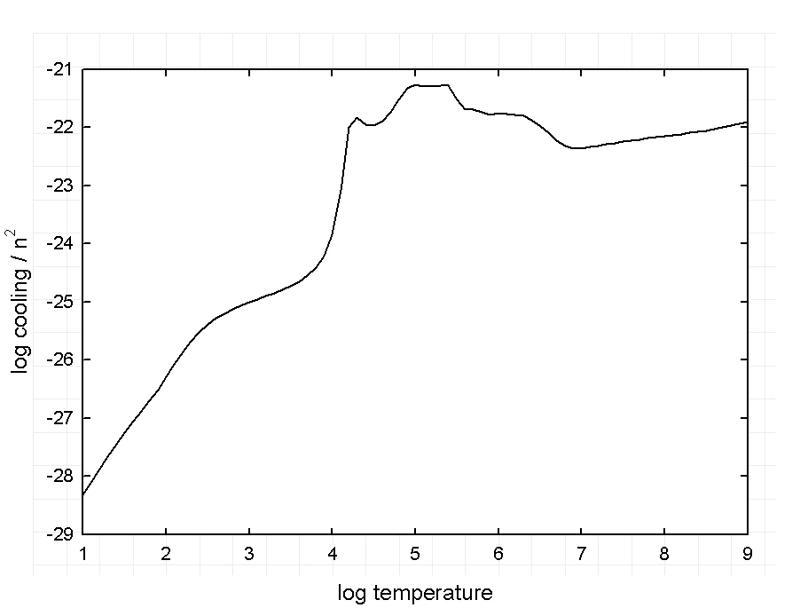

Read me for Hazy cooling curve sample program
=============================================

This is an example of a gas in collisional ionization equilibrium in which
only the temperature is varied.
The gas temperature is varied over a very broad range and only the cosmic
background and cosmic rays are included.
The hydrogen density and gas kinetic temperature are specified and a single
zone is computed.
The temperature and cooling divided by _n_(H)2 are printed.
This was used to create a figure in Hazy.

This figure shows the total cooling over the density squared.
The x-axis is the log of the gas temperature (K).
The y-axis is the cooling divided by the square of the density
(erg s-1 cm3).

last modified 19 July, 2008
