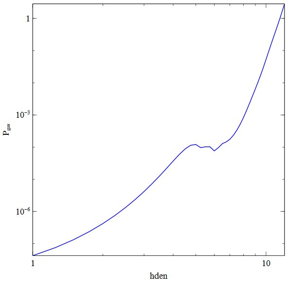
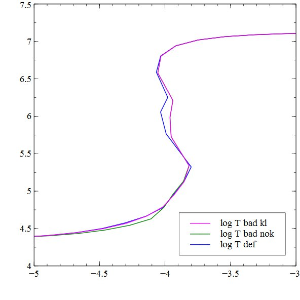

Read me for hazy\_kmt
=====================

hazy\_kmt.c
-----------

This redoes the "S-curve" calculation originally done by Krolick, McKee, &
Tarter (1981; ApJ, 249, 422).
The gas density is varied between 101 and 1012 cm\-3.
It is exposed to the cosmic background and an AGN continuum.
The output file _hazy\_kmt.txt_ gives the log of the temperature,
the temperature (K), and pressure.

The x-axis is the log of the density, and the y-axis is the gas pressure.

The same data is plotted below but with different ratios in the more common
form of the S curve.
The x-axis is the log of the ratio of the ionization parameter to the
temperature and the y axis is the log of the temperature.
This plot shows the effects of several of the dielectronic recombination data
that are available within the code.
Chakravorty et al (2008, MNRAS, 384L, 24, available
[here](http://adsabs.harvard.edu/abs/2008MNRAS.384L..24C))
discuss how the DR rates change the nature of the S curve.

last modified 19 July, 2008
