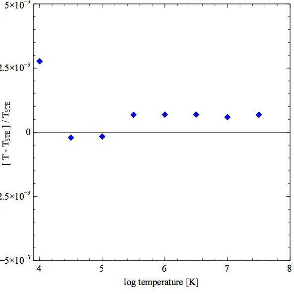

Read me for hi-Z LTE sample program
===================================

This computes a series of models that test the code in the strict thermodynamic
equilibrium limit.
The radiation field is a true black body with the energy density and color
temperatures equal.
It between 104<\sup> K and 107.5 K.
The gas kinetic temperature should equal the radiation field temperature.
The gas has a very high metallicity so that the heavy elements dominate the
thermal equilibrium.
The output gives the black body temperature, the gas kinetic temperature,
and the relative difference between the two.

In this figure the x-axis is the log of the black body temperature.
The y-axis is the relative difference between the black body and gas kinetic
temperatures.
The two should be equal, and are, to substantially better than 1%.

last modified 19 Oct, 2011
