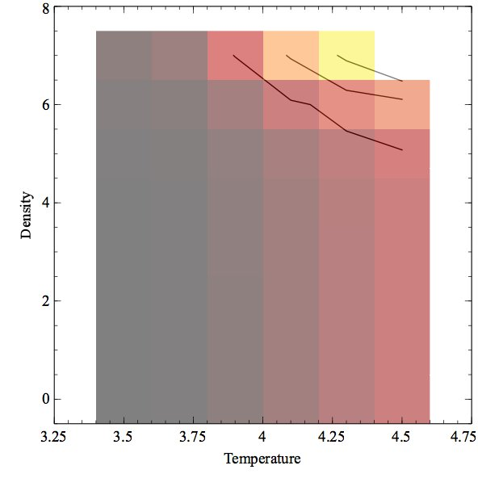

Read me for vary\_nete
======================

vary\_nete.cpp
--------------

This is an example of a calculation in which two parameters, the electron
density and gas kinetic temperature, are varied over a broad range.
Relative intensities of several \[O III\] lines are predicted.

This figure shows the \[O III\] 4363 / 5007 ratio as a function of density
and temperature, as output from this program.

last modified 19 July, 2008
