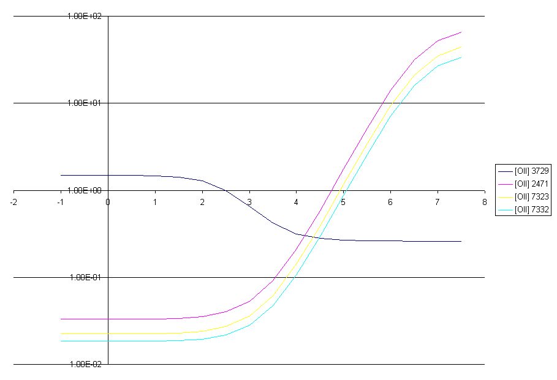

Read me for varyn
=================

This is a series of calculations in which the density is varied, and the
intensities of some \[OII\] lines relative to \[OII\] 3727 are printed.
The plot shows two density-sensitive ratios.

The x-axis is the log of the electron density (cm-3) and the y-axis is the
intensity of the line relative to \[OII\] 3727.

last modified 19 July, 2008
